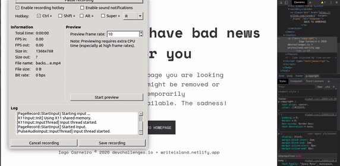

<!-- Please update value in the {}  -->

<h1 align="center">Dare-dev--one</h1>

   Solution for a challenge from  <a href="http://devchallenges.io" target="_blank">Let's go!</a>.

Let's go! align="center">
  <h3>
    <a href="https://warrior4o4.netlify.app/">
      Demo
    </a>
     | 
    <a href="https://github.com/iagokrt/dare-dev--one">
      Solution
    </a>
     | 
    <a href="https://devchallenges.io/challenges/wBunSb7FPrIepJZAg0sY">
      Challenge
    </a>
  </h3>

<!-- TABLE OF CONTENTS -->

## Table of Contents

- [Overview](#overview)
  - [Built With](#built-with)
- [Features](#features)
- [Contact](#contact)
- [Acknowledgements](#acknowledgements)

<!-- OVERVIEW -->

## Overview

Here you can find the Demo https://warrior4o4.netlify.app/ 

Fast and Furious HTML5/CSS3 Coding!

## Features

<!-- List the features of your application or follow the template. Don't share the figma file here :) -->

Not much to know. Just a Missing page. The sadness! 

## Contact

- Website [writeisland.netlify.app](https://writeisland.netlify.app)
- GitHub [@iagokrt](https://github.com/iagokrt)
- Twitter [@iagokrt](https://twitter.com/iagokrt)
